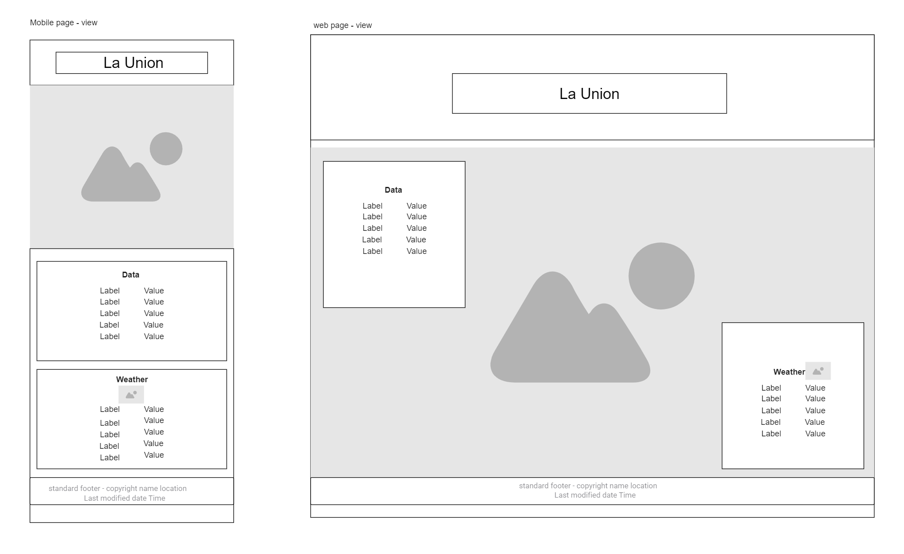

color palette 

Colors: #048bbf, #8c9592, #c1d7e1, #efdedf, #644b3c

theme: beach

HTML skeleton

Header:

A single, centered page title at the very top, labeled “La Union”.
No navigation bar or menu.
Hero Image:

Directly below the title, there is a large, full-width hero image.
The image spans the main content area and serves as a strong visual introduction.
Main Content Area:

Contains exactly two vertically stacked cards/sections:
Data Card:
The first (top) card is labeled “Data”.
Intended for displaying data, statistics, or key information about La Union.
The card is visually separated (e.g., with a border or background) from the rest of the content.
Weather Card:
The second (bottom) card is labeled “Weather”.
Intended for displaying weather information relevant to La Union.
Also visually separated as a card/box. (I also notice to add icon for weather check wireframe to validate)
Footer:

Located at the very bottom of the page.
Centered horizontally.
Contains placeholder text (such as copyright).
Layout/Responsiveness:

The two cards (“Data” and “Weather”) are stacked vertically in both wide (desktop) and mobile views.
The design is clean, minimal, and easy to read.
No sidebars, galleries, contact forms, or navigation links are present.

wireframe: 
external link: https://app.moqups.com/unsaved/7b8ec48b/view/page/ad64222d5